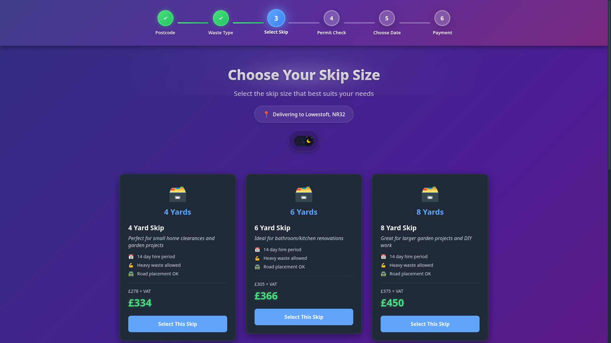
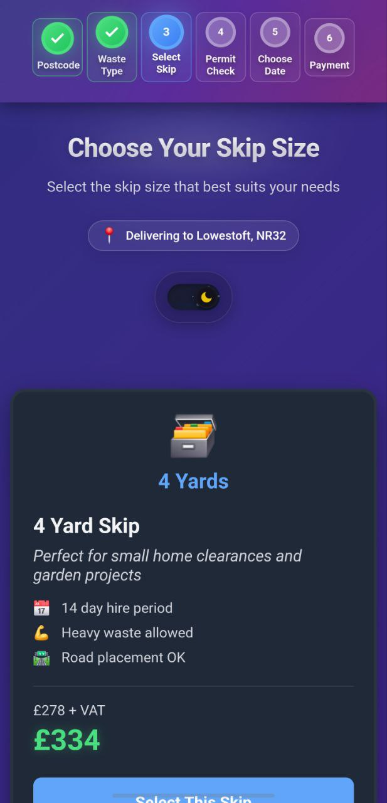

# Skip Selector - Modern React Application

A professional, responsive, and themeable application for selecting skip sizes for waste management services. This project was created as a React coding challenge to redesign the skip selection page from wewantwaste.co.uk with enhanced UI/UX, complete responsiveness, and modern React best practices.

## Screenshots

<div align="center">

### Desktop Experience


*Modern desktop interface with sticky progress bar and responsive card layout*

### Mobile Experience


*Optimized mobile interface with touch-friendly interactions*

### Side-by-Side Comparison
<div style="display: flex; justify-content: center; align-items: flex-start; gap: 20px; flex-wrap: wrap;">
  <div style="text-align: center;">
    
    <br><em>Desktop Experience</em>
  </div>
  <div style="text-align: center;">
    
    <br><em>Mobile Experience</em>
  </div>
</div>

</div>

## Challenge Overview

This project was developed as part of a front-end coding challenge with the following requirements:
- Redesign the skip selection page from wewantwaste.co.uk to look completely different while maintaining functionality
- Focus on clean, maintainable React code, responsiveness, and UI/UX improvements
- Ensure proper display on both mobile and desktop browsers
- Use live API data from wewantwaste.co.uk to populate skip options

## Features

- ✅ **Dark/Light Theme Support** - Attractive color schemes for both modes with automatic system preference detection
- ✅ **Responsive Design** - Works seamlessly on mobile, tablet and desktop
- ✅ **Modern UI Elements** - Interactive components with subtle animations and transitions
- ✅ **Progress Tracking** - Visual progress indicator showing the booking journey
- ✅ **Interactive Cards** - Visual skip selection with detailed information
- ✅ **Accessibility** - WCAG compliant with proper focus indicators and reduced motion support

## Technology Stack

- React 19
- CSS3 with CSS Variables for theming
- Context API for state management
- Custom Hooks for data fetching
- Responsive design with CSS Grid and Flexbox

## Design Approach

### Theming System

The application uses a robust theming system based on CSS variables that enables seamless switching between dark and light modes. The theme is controlled via a Context API provider that:

- Detects user system preferences
- Stores user preference in local storage
- Provides an intuitive toggle UI component
- Applies theme changes in real-time

### Visual Design

The design follows these key principles:

1. **Clarity** - Clear visual hierarchy, readable typography, and intuitive interactions
2. **Consistency** - Uniform spacing, consistent color usage, and cohesive component design
3. **Feedback** - Interactive elements provide visual feedback through subtle animations
4. **Aesthetics** - Modern, clean visual style with appropriate use of shadows, gradients, and transitions

### Component Architecture

Components are built with reusability and maintainability in mind:

- **SkipSelector** - Main orchestrating component that manages state and layout
- **ProgressBar** - Visual indicator of the user's journey through the selection process
- **SkipCard** - Interactive card displaying skip information and selection controls
- **ThemeToggle** - Animated toggle for switching between themes
- **LoadingSpinner** - Feedback component for asynchronous operations

### UX Enhancements

- **Entrance Animations** - Components animate into view to create a polished experience
- **Interactive Elements** - Buttons, cards, and toggles have hover/focus states with subtle transitions
- **Loading States** - Clear indicators when data is loading
- **Error Handling** - User-friendly error messages with recovery options
- **Responsive Behavior** - Layout adapts to different screen sizes with appropriate component sizing

## Key Features Demonstrated

### 🎨 Modern UI/UX Design
- Vibrant gradient backgrounds with smooth transitions
- Card-based layout with hover animations
- Sticky progress navigation with step indicators
- Professional color scheme and typography

### 📱 Responsive Excellence
- Mobile-first design approach
- Optimized touch targets for mobile devices
- Adaptive layouts that work on all screen sizes
- Progressive enhancement for larger screens

### ⚡ Performance Optimized
- Minimal dependencies for fast loading
- Efficient CSS animations and transitions
- Optimized images and assets
- Clean code architecture for maintainability

### ♿ Accessibility First
- WCAG AA compliant contrast ratios
- Keyboard navigation support
- Screen reader compatible markup
- Reduced motion preferences respected

## Installation and Setup

1. Clone the repository:
```bash
git clone https://github.com/yourusername/skip-selector-redesign.git
cd skip-selector-redesign
```

2. Install dependencies:
```bash
npm install
```

3. Start the development server:
```bash
npm start
```

4. Open [http://localhost:3000](http://localhost:3000) to view it in your browser.

## Project Structure

```
skip-selector-redesign/
├── public/
│   ├── index.html
│   └── favicon.ico
├── src/
│   ├── components/
│   │   ├── SkipSelector.js
│   │   ├── SkipCard.js
│   │   ├── ProgressBar.js
│   │   ├── ThemeToggle.js
│   │   └── LoadingSpinner.js
│   ├── hooks/
│   │   └── useSkipData.js
│   ├── context/
│   │   └── ThemeContext.js
│   ├── styles/
│   │   └── styles.css
│   ├── App.js
│   └── index.js
└── README.md
```

## Browser Support

The application supports all modern browsers including:

- Chrome (latest)
- Firefox (latest)
- Safari (latest)
- Edge (latest)

## Accessibility Considerations

- **Keyboard Navigation** - All interactive elements are properly focused
- **Screen Readers** - Semantic HTML with appropriate ARIA attributes
- **Reduced Motion** - Respects user preference for reduced motion
- **Color Contrast** - WCAG AA compliant contrast ratios
- **Focus Indicators** - Clearly visible focus states for keyboard users

## Future Improvements

- Add end-to-end testing with Cypress
- Implement more advanced animations with Framer Motion
- Add multilingual support
- Integrate with more payment providers
- Add analytics tracking for user behavior

## License

MIT

## Credits

Designed and developed by nuk(yousif) for the wewantwaste.co.uk React coding challenge